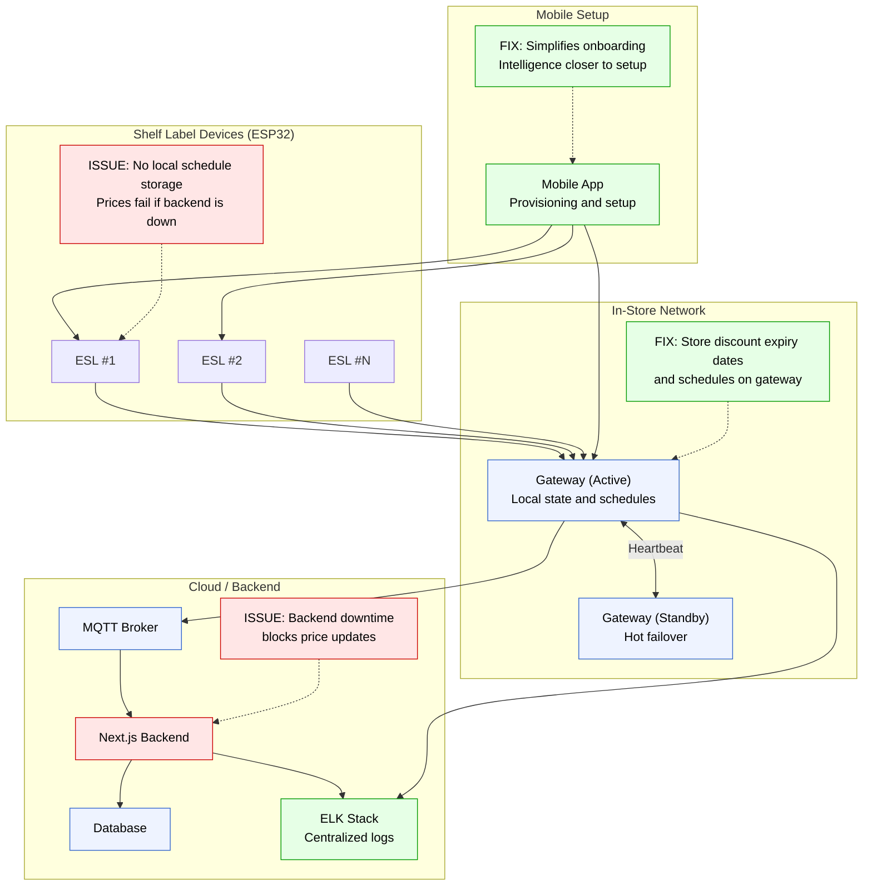

# ESL System Architecture

## Overview

This document describes the Electronic Shelf Label (ESL) system architecture, highlighting current implementation issues and proposed improvements based on teacher feedback.

## Teacher Feedback Summary

### Problems Identified

1. **Registration and Setup Process**: The current manual process would be unreasonably cumbersome for supermarkets with thousands of products and hundreds of shelves.
2. **Backend Dependency**: If the backend is down, prices would not be updated, causing operational failures.
3. **Security Gaps**: The current implementation lacks adequate security measures.

### Suggested Solutions

1. **Mobile App Integration**: Add a mobile app to provide "intelligence closer to the setup process" for easier provisioning.
2. **Redundant System**: Store discount expiry dates and schedules on-device to maintain functionality during backend outages.
3. **ELK Stack**: Implement centralized logging and log aggregation using the ELK stack.

## Current vs Proposed Architecture

The following diagram visualizes the proposed architecture with clear indicators of issues and fixes:



## Architecture Components

### 1. Shelf Label Devices (ESP32/Arduino Uno)

**Current Implementation:**
- ESP32/Arduino Uno with LED matrix display
- Communicates with gateway via ESP-NOW or BLE Mesh
- Receives display updates from gateway

**Identified Issues:**
- No local schedule storage
- Cannot update prices when backend is unavailable
- Dependency on constant connectivity

**Proposed Improvements:**
- Store last known pricing state
- Cache discount schedules with expiry dates
- Execute scheduled price changes autonomously
- Sync time from gateway (not NTP)

### 2. Gateway Layer (Raspberry Pi)

**Current Implementation:**
- Raspberry Pi Pico 2 W running Python daemon
- Scans for labels via BLE
- Communicates with cloud backend via MQTT over TLS
- Pushes updates to labels

**Strengths:**
- Already implements local state storage
- Hot failover with dual gateway setup
- Secure communication via TLS

**Proposed Improvements:**
- Enhanced schedule storage for discount expiry dates
- Full pricing state cache
- Event reconciliation when cloud returns
- Integration with ELK stack for logging

### 3. Mobile Setup Application

**Purpose:**
- Simplify the onboarding process for thousands of products
- Provide "intelligence closer to the setup process"

**Key Features:**
- QR code scanning for rapid device provisioning
- ESL to shelf assignment via mobile interface
- Product to label mapping
- BLE/local connectivity for in-store setup
- Offline-capable with local caching

**Benefits:**
- Drastically reduces setup time
- Eliminates manual serial number entry
- Provides immediate feedback during provisioning
- Reduces human error in large-scale deployments

### 4. Cloud Backend (Next.js)

**Current Implementation:**
- Next.js backend with tRPC APIs
- SQLite/Turso database
- REST API for gateway communication

**Identified Issues:**
- Single point of failure
- Price updates blocked during downtime

**Proposed Improvements:**
- Stateless design - gateways are source of truth
- Event sourcing for state reconciliation
- Event queue (Kafka/NATS/SQS) for asynchronous processing
- Redis for caching

### 5. MQTT Broker

**Implementation:**
- MQTT over TLS (QoS 1)
- Provides message ordering and offline buffering
- Enables retry logic for failed deliveries

**Benefits:**
- Reliable message delivery
- Low bandwidth usage
- Industry-standard for IoT

### 6. ELK Stack (Logging & Monitoring)

**Components:**
- Elasticsearch: Log storage and search
- Logstash: Log processing pipeline
- Kibana: Visualization and dashboards

**Purpose:**
- Centralized log aggregation from all components
- Real-time monitoring and alerting
- Troubleshooting and debugging
- Operational insights and analytics

**Integration Points:**
- Next.js backend application logs
- Gateway daemon logs
- MQTT broker logs
- System health metrics

## Security Model

### Device Identity
- Unique device ID and key burned at factory
- No shared secrets across devices
- QR codes for physical device identification

### Gateway Security
- X.509 certificate per store
- Mutual TLS with cloud backend
- Session keys rotated via gateway

### ESP32/Label Security
- Paired to one gateway
- Session keys rotated regularly
- No direct cloud communication

### Zero Trust Principles
- ESLs never talk directly to cloud
- Gateways scoped per store
- Least privilege access model

## Provisioning & Setup at Scale

### Factory Pre-Configuration
1. Flash ESL with unique device ID and public key
2. Generate QR code label for physical device
3. Register device serial numbers in system

### In-Store Setup Process
1. Install gateway hardware
2. Gateway auto-registers to cloud
3. Staff uses mobile app to scan shelf QR code
4. Staff scans ESL QR code
5. Mobile app assigns ESL to shelf and product
6. ESL joins mesh network automatically
7. Gateway receives configuration and pushes to ESL

### Benefits
- No per-device Wi-Fi configuration needed
- Local-first approach minimizes cloud dependency
- Scalable to thousands of labels per store
- Intuitive mobile-driven workflow

## Redundancy & Resilience

### Gateway Redundancy
- Two gateways per store (active/passive)
- ESLs remember last 2 gateways
- Hot-standby via heartbeat monitoring
- Automatic failover on primary failure

### Schedule Execution
- Gateway executes pricing schedules without cloud
- ESLs sync time from gateway
- Cloud outage = no visible failure in store
- State reconciliation when cloud returns

### Data Flow Model

**Command Flow:**
```
Backend → Event Queue → MQTT → Gateway → ESL
```

**State Flow:**
```
ESL → Gateway (ack + battery + health)
Gateway → Cloud (aggregated, batched)
```

### Design Principle
> Stores must keep working even if the internet dies.
> - Cloud = coordination & analytics
> - Gateway = source of truth
> - ESLs = display only

## Communication Protocols

### ESP32 ↔ Gateway
- **Primary**: ESP-NOW or BLE Mesh (low power)
- **Fallback**: Low-power Wi-Fi

### Gateway ↔ Cloud
- **Protocol**: MQTT over TLS (QoS 1)
- **Benefits**: Retries, ordering, offline buffering

### Backend Internal
- **Event Queue**: Kafka / NATS / SQS
- **APIs**: REST for gateways, tRPC for web UI

## Technology Stack

### Backend
- **Framework**: Next.js
- **APIs**: REST + tRPC
- **Database**: PostgreSQL + Redis
- **Message Queue**: Kafka / NATS / SQS
- **Auth**: Better Auth

### Gateway
- **Hardware**: Raspberry Pi Pico 2 W
- **Language**: Python
- **Protocols**: MQTT, BLE

### Labels
- **Hardware**: ESP32 / Arduino Uno R4 WiFi
- **Protocol**: ESP-NOW / BLE Mesh
- **Display**: LED Matrix

### Infrastructure
- **Message Broker**: EMQX / Mosquitto / AWS IoT Core
- **Logging**: ELK Stack (Elasticsearch, Logstash, Kibana)
- **Monitoring**: OpenTelemetry + Grafana

## Implementation Roadmap

### Phase 1: Core Fixes (Critical)
- [ ] Implement local schedule storage on gateways
- [ ] Add discount expiry date tracking
- [ ] Enable autonomous schedule execution
- [ ] Deploy ELK stack for centralized logging

### Phase 2: Mobile Application (High Priority)
- [ ] Design mobile app architecture
- [ ] Implement QR code scanning
- [ ] Build provisioning workflow
- [ ] Add offline support
- [ ] Integrate with backend APIs

### Phase 3: Enhanced Resilience (Medium Priority)
- [ ] Implement event sourcing for state reconciliation
- [ ] Add state caching on ESL devices
- [ ] Enhance gateway failover logic
- [ ] Add comprehensive monitoring

### Phase 4: Security Hardening (Ongoing)
- [ ] Implement X.509 certificate management
- [ ] Add session key rotation
- [ ] Enable mutual TLS
- [ ] Security audit and penetration testing

## Next Steps

To address the teacher's feedback, the team should prioritize:

1. **Immediate**: Design and prototype the mobile provisioning app
2. **Immediate**: Implement local scheduling on gateways
3. **Short-term**: Deploy ELK stack for logging
4. **Short-term**: Document security implementation plan
5. **Medium-term**: Test resilience during simulated backend failures

## References

- [API Documentation](./api-documentation.md)
- [Hardware Setup Guide](./hardware-setup.md)
- [Service Guide](./service-guide.md)
- [Team Ground Rules](./team_ground_rules.md)
